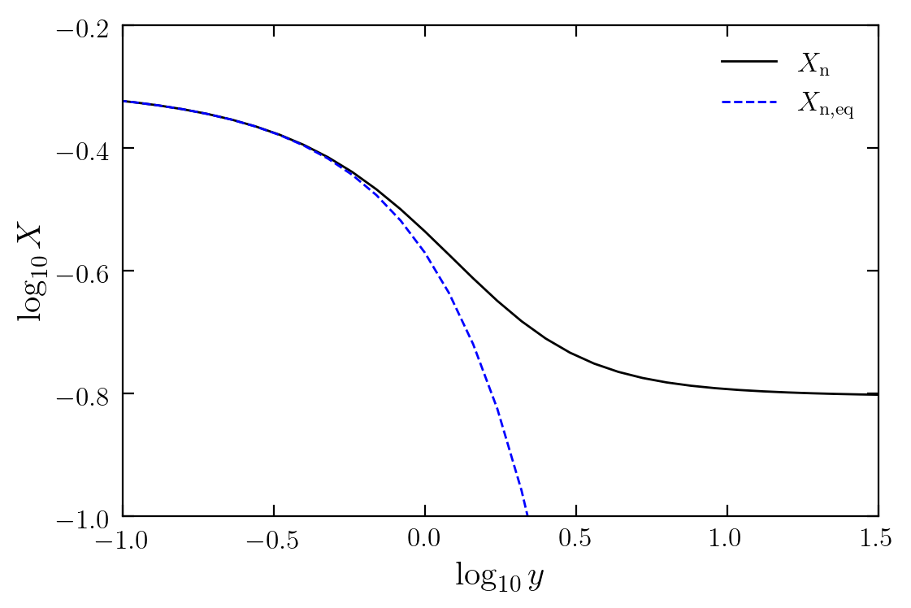
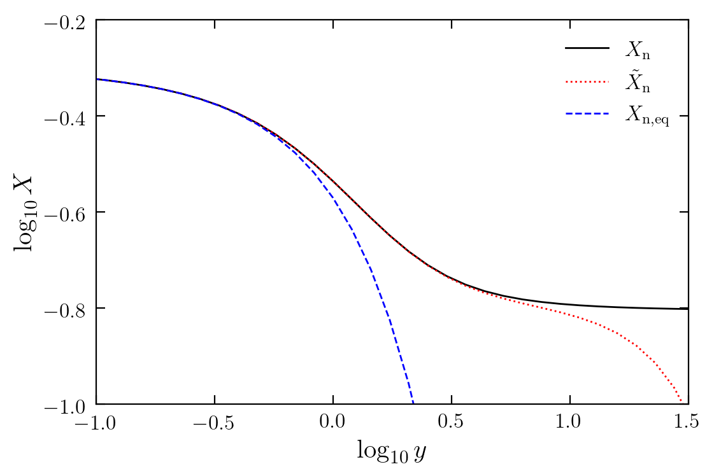
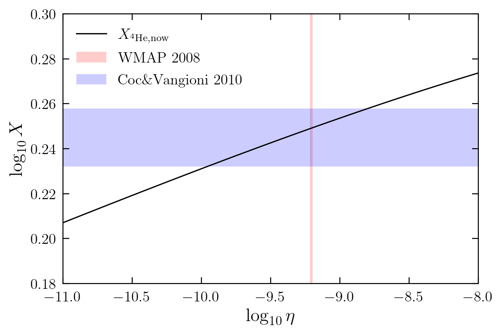

## Astronomy 534 "Extragalactic Universe" (Winter 2021)

## Project 1: Helium-4 abundance

By Bill Chen

## 1. Introduction

The theory of big bang nucleosynthesis (BBN) successfully reveals the origin of $^4$He abundance. At a temperature of $\sim 10^{10}\ {\rm K}$, i.e., when the weak interaction rate drops below the expansion rate of the universe, the $\rm n\leftrightarrow p$ processes freezes-out. As a consequence, the neutron abundance is almost constant hereafter, except for a slight drop due to neutron decay. Shortly after the neutron freeze-out, the temperature drops to $\sim 10^9\ {\rm K}$, opening the "bottleneck" of synthesizing deuterium, which turns on the BBN and quickly transports almost all neutrons to $^4$He. Once neutrons are captured by $^4$He, they no longer participate in neutron decay and keep the abundance to the present.

In this work, we (I mean "I") first investigate the freeze-out abundance of neutrons by solving the interaction rate equation. After that, we calculate how neutron decay influences neutron abundance. Next, we solve the time of BBN considering the baryon-to-photon ratio. Finally, we modify the abundances of neutrons as well as $^4$He by taking into account the number loss of neutron via neutron-decay.

## 2. Freeze-out abundance of neutrons

### 2.1. Interaction rate equation

To get the freeze-out abundance of species $i$,

$$
a+b\leftrightarrow i+j,
$$

we can refer to MBW Eq. (3.162),

$$
\frac{dn_i}{dt} + 3H(t)n_i = \alpha(T)n_an_b-\beta(t)n_in_j.
$$

Assuming $a$ and $b$ are in thermal equilibrium with the hot plasma, we get MBW Eq. (3.164),

$$
\frac{dn_i}{dt} + 3H(t)n_i = \beta(T)(n_{i,{\rm eq}}^2-n_i^2).
$$

However, this assumption is **not** applicable for neutron freeze-out, which is mainly controlled by

$$
\rm
p+e^-\leftrightarrow n+\nu, \\
p+\bar{\nu}\leftrightarrow n+e^+,
$$

where we can assume neutrinos and electrons/positrons are in thermal equilibrium with the hot plasma (this can be a good enough approximation, see, Bernstein, Brown & Feinberg [1989](https://journals.aps.org/rmp/abstract/10.1103/RevModPhys.61.25)). Let's first consider $\rm p+e^-\leftrightarrow n+\nu$, so that MBW Eq. (3.162) becomes

$$
\frac{dn_{\rm n}}{dt} + 3H(t)n_{\rm n} = \beta_{\rm pe\rightarrow n\nu}(t)n_{\rm e}n_{\rm p} - \beta_{\rm n\nu\rightarrow pe}(t)n_{\rm \nu}n_{\rm n},
$$

in which

$$
\beta_{\rm pe\rightarrow n\nu}(t)n_{\rm e}n_{\rm p,eq} - \beta_{\rm n\nu\rightarrow pe}(t)n_{\rm \nu}n_{\rm n,eq} = 0.
$$

Combining the above equations gives

$$
\frac{dn_{\rm n}}{dt} + 3H(t)n_{\rm n} = \beta_{\rm pe\rightarrow n\nu}(t)n_{\rm e}(n_{\rm p}-n_{\rm p,eq}) - \beta_{\rm n\nu\rightarrow pe}(t)n_{\rm \nu}(n_{\rm n}-n_{\rm n,eq}).
$$

For convenience, we can rewrite the above equation in terms of abundance, $X_{\rm n}=n_{\rm n}/n_{\rm b}$, by dividing both sides by the number density of baryons, $n_{\rm b}$,

$$
\frac{1}{n_{\rm b}}\frac{dn_{\rm n}}{dt} + 3H(t)X_{\rm n} = \beta_{\rm pe\rightarrow n\nu}(t)n_{\rm e}(X_{\rm p}-X_{\rm p,eq}) - \beta_{\rm n\nu\rightarrow pe}(t)n_{\rm \nu}(X_{\rm n}-X_{\rm n,eq}),
$$

where

$$
\frac{1}{n_{\rm b}}\frac{dn_{\rm n}}{dt} 
= \frac{dX_{\rm n}}{dt} - n_{\rm n}\frac{d}{dt}\left(\frac{1}{n_{\rm b}}\right) 
= \frac{dX_{\rm n}}{dt} - 3H(t)X_{\rm n}.
$$

Thus, the $H(t)$ term cancels out,

$$
\frac{dX_{\rm n}}{dt} = \beta_{\rm pe\rightarrow n\nu}(t)n_{\rm e}(X_{\rm p}-X_{\rm p,eq}) - \beta_{\rm n\nu\rightarrow pe}(t)n_{\rm \nu}(X_{\rm n}-X_{\rm n, eq}).
$$

Similarly, we can add the contribution of $\rm p+\bar{\nu}\leftrightarrow n+e^+$ to the above equation,

$$
\frac{dX_{\rm n}}{dt} = [\beta_{\rm pe\rightarrow n\nu}(t)n_{\rm e}+\beta_{\rm p\nu\rightarrow ne}(t)n_{\rm \nu}](X_{\rm p}-X_{\rm p,eq}) - [\beta_{\rm n\nu\rightarrow pe}(t)n_{\rm \nu}+\beta_{\rm ne\rightarrow p\nu}(t)n_{\rm e}](X_{\rm n}-X_{\rm n,eq}).
$$

Let $\lambda_{\rm p\rightarrow n}(t) = \beta_{\rm pe\rightarrow n\nu}(t)n_{\rm e}+\beta_{\rm p\nu\rightarrow ne}(t)n_{\rm \nu}$ and $\lambda_{\rm n\rightarrow p}(t) = \beta_{\rm n\nu\rightarrow pe}(t)n_{\rm \nu}+\beta_{\rm ne\rightarrow p\nu}(t)n_{\rm e}$ be the interaction rates per proton/neutron. We get

$$
\frac{dX_{\rm n}}{dt} = \lambda_{\rm p\rightarrow n}(t)(X_{\rm p}-X_{\rm p,eq}) - \lambda_{\rm n\rightarrow p}(t)(X_{\rm n}-X_{\rm n,eq}).
$$

Given $X_{\rm n} + X_{\rm p} = 1$, the above equation can be simplified into

$$
\frac{dX_{\rm n}}{dt} = -[\lambda_{\rm p\rightarrow n}(t)+\lambda_{\rm n\rightarrow p}(t)](X_{\rm n}-X_{\rm n,eq}).
$$

This interaction rate equation, different from MBW Eq. (3.164), describes the evolution of neutron abundance in the expanding universe. This equation is consistent with various previous works (e.g., Peebles [1966](https://ui.adsabs.harvard.edu/abs/1966ApJ...146..542P/abstract), Bernstein, Brown & Feinberg [1989](https://journals.aps.org/rmp/abstract/10.1103/RevModPhys.61.25)), Mukhanov [2003](https://arxiv.org/abs/astro-ph/0303073)).

### 2.2 Rates of weak interactions

To calculate the rates of weak interactions, $\lambda_{\rm p\rightarrow n}$ and $\lambda_{\rm n\rightarrow p}$, we first consider the $\rm n+\nu\rightarrow p+e^-$ interaction. Following Weinberg ([1972](https://ui.adsabs.harvard.edu/abs/1972gcpa.book.....W/abstract)) to apply the Fermi theory of 4-fermion interaction, we get

$$
\lambda_{\rm n\nu\rightarrow pe}(T) = \frac{1+3g_{\rm A}^2}{2\pi^3}G_{\rm F}^2\int_0^\infty dp_{\rm\nu}p_{\rm\nu}^2p_{\rm e}E_{\rm e}(1-f_{\rm e})f_{\rm\nu},
$$

where 

$$
f_{\rm\nu} = \frac{1}{1+e^{E_{\rm\nu}/k_{\rm B}T}},\ f_{\rm e} = \frac{1}{1+e^{E_{\rm e}/k_{\rm B}T}},
$$

Note that we have assumed neutrinos and electrons/positrons are in thermal equilibrium with the hot plasma, i.e., $T_{\rm\nu}=T_{\rm e}=T$. Assume only electrons and neutrinos have nonzero kinetic energy, i.e., $E_{\rm e}-E_{\rm\nu}=Q=1.29\ {\rm MeV}$, and let $y=Q/k_{\rm B}T$, we get (Mukhanov [2003](https://arxiv.org/abs/astro-ph/0303073))

$$
\lambda_{\rm n\nu\rightarrow pe}(y) \simeq \frac{1+3g_{\rm A}^2}{2\pi^3}\frac{G_{\rm F}^2}{\hbar}\left(\frac{Q}{y}\right)^5\left[\frac{45\zeta(5)}{2} + \frac{7\pi^4}{60}y + \frac{3\zeta(3)}{2}\left(1-\frac{1}{2}\left(\frac{m_ec^2}{Q}\right)^2\right)y^2\right],
$$

where $G_{\rm F}$ is the Fermi coupling constant, and $g_{\rm A}\simeq 1.26$ is the correction to the axial vector "weak charge" of the nucleon. Similarly, we have

$$
\lambda_{\rm ne\rightarrow p\nu}(y) \simeq \lambda_{\rm n\nu\rightarrow pe}(y)
$$

and

$$
\lambda_{\rm pe\rightarrow n\nu}(y) \simeq \lambda_{\rm p\nu\rightarrow ne}(y) \simeq e^{-y}\lambda_{\rm n\nu\rightarrow pe}(y).
$$

Combining the above equations gives

$$
\frac{dX_{\rm n}}{dt} \simeq -2(1+e^{-y})\lambda_{\rm n\nu\rightarrow pe}(y)(X_{\rm n}-X_{\rm n,eq}).
$$

### 2.3 Solution to the interaction rate equation

In order to solve the interaction rate equation, it's convenient to convert time and temperature into the $y$ parameter. In radiation dominated era, we have

$$
\frac{dX_{\rm n}}{dt} = \frac{dT}{dt}\frac{dy}{dT}\frac{dX_{\rm n}}{dy}
= \left(\frac{4\pi^3}{45}g_*\right)^{1/2}\left(\frac{G}{c^5\hbar^3}\right)^{1/2}\frac{Q^2}{y}\frac{dX_{\rm n}}{dy},
$$

where 

$$
g_*= g_\gamma + \frac{7}{8}(g_{e^-} + g_{e^+} + 3g_{\nu} + 3g_{\bar{\nu}}) = \frac{43}{4}
$$

since we have assumed that neutrinos and electrons/positrons are in thermal equilibrium with the hot plasma. Therefore, the interaction rate equation becomes

$$
\frac{dX_{\rm n}}{dy} 
\simeq -2(1+e^{-y})\frac{1+3g_{\rm A}^2}{2\pi^3}\left(\frac{45}{43\pi^3}\right)^{1/2}\left(\frac{c^5\hbar}{G}\right)^{1/2}G_{\rm F}^2Q^3\frac{1}{y^4}\left[\frac{45\zeta(5)}{2} + \frac{7\pi^4}{60}y + \frac{3\zeta(3)}{2}\left(1-\frac{1}{2}\left(\frac{m_ec^2}{Q}\right)^2\right)y^2\right](X_{\rm n}-X_{\rm n,eq}).
$$

Inserting values and $X_{\rm n,eq}=1/(1+e^y)$ to the above equation gives

$$
\frac{dX_{\rm n}}{dy} 
\simeq -2.858(1+e^{-y})\frac{1 + 0.487y + 0.071y^2}{y^4}\left(X_{\rm n}-\frac{1}{1+e^y}\right).
$$

The numerical solution to this equation gives the freeze-out abundance of neutrons,

$$
X_n(y\rightarrow\infty) \simeq 0.157,
$$

corresponding to a freeze-out $y$ parameter of

$$
y^* \simeq X_{\rm n,eq}^{-1}(0.157) \simeq 1.68,
$$

or a freeze-out temperature of 

$$
T^* \simeq 0.77\ {\rm MeV}.
$$

A visualization of this solution is given below.


```python
# import packages
%matplotlib inline
import numpy as np
import matplotlib.pyplot as plt
from scipy.integrate import odeint
plt.style.use('../mplstyle.txt')
```


```python
# numerically solve the rate equation: dX/dy = func(X, y)
func = lambda X, y: -2.858 * (1+np.exp(-y)) * (1+0.487*y+0.071*y**2) * ( X - (1/(1+np.exp(y))) ) / y**4

y_list = 10**np.linspace(-6, 2, 100+1)
Xn = np.squeeze(odeint(func, 0.5, y_list)) # numerically solve ODE
Xn_eq = 1/(1+np.exp(y_list))
```


```python
# make plot
fig, ax = plt.subplots()

ax.plot(np.log10(y_list), np.log10(Xn), lw=1, c='k', label=r'$X_{\rm n}$')
ax.plot(np.log10(y_list), np.log10(Xn_eq), lw=1, c='b', ls='--', label=r'$X_{\rm n,eq}$')

ax.set_xlabel(r'$\log_{10}y$')
ax.set_ylabel(r'$\log_{10}X$')

ax.set_xlim(-1,1.5)
ax.set_xticks([-1,-0.5,0,0.5,1,1.5])

ax.set_ylim(-1,-0.2)
ax.set_yticks([-1,-0.8,-0.6,-0.4,-0.2])

ax.legend()
plt.show()
```





## 3. Abundance of neutrons considering neutron decay

Considering neutron decay,

$$
\rm n\rightarrow p+\bar{\nu}+e^-,
$$

we modify the reaction rate equation into

$$
\frac{d\tilde{X}_{\rm n}}{dt} = -[\lambda_{\rm p\rightarrow n}(t)+\lambda_{\rm n\rightarrow p}(t)](\tilde{X}_{\rm n}-X_{\rm n,eq}) - \frac{1}{\tau}\tilde{X}_{\rm n},
$$

where $\tau=886\ {\rm s}$ is the lifetime of neutron. In terms of $y$, this equation becomes

$$
\frac{d\tilde{X}_{\rm n}}{dy} 
\simeq -2.858(1+e^{-y})\frac{1 + 0.487y + 0.071y^2}{y^4}\left(\tilde{X}_{\rm n}-\frac{1}{1+e^y}\right) - 10^{-3}y\tilde{X}_{\rm n}.
$$

The numerical solution to this equation is given below.


```python
# numerically solve the rate equation: dX/dy = func(X, y) + func2(X, y)
func2 = lambda X, y: func(X, y) - 1e-3 * y * X
Xn2 = np.squeeze(odeint(func2, 0.5, y_list)) # numerically solve ODE
```


```python
# make plot
fig, ax = plt.subplots()

ax.plot(np.log10(y_list), np.log10(Xn), lw=1, c='k', label=r'$X_{\rm n}$')
ax.plot(np.log10(y_list), np.log10(Xn2), lw=1, c='r', ls=':', label=r'$\tilde{X}_{\rm n}$')
ax.plot(np.log10(y_list), np.log10(Xn_eq), lw=1, c='b', ls='--', label=r'$X_{\rm n,eq}$')

ax.set_xlabel(r'$\log_{10}y$')
ax.set_ylabel(r'$\log_{10}X$')

ax.set_xlim(-1,1.5)
ax.set_xticks([-1,-0.5,0,0.5,1,1.5])

ax.set_ylim(-1,-0.2)
ax.set_yticks([-1,-0.8,-0.6,-0.4,-0.2])

ax.legend()
plt.show()
```





## 4. Opening time of "deuterium bottleneck"

As mentioned above, the time of BBN is controlled by the "deuterium bottleneck". Since deuterium is produced by

$$
\rm p+n\leftrightarrow D+\gamma,
$$

its abundance is given by MBW Eq. (3.210),

$$
X_{\rm D} = 16.4X_{\rm n}X_{\rm p}\eta\left(\frac{m_{\rm N}c^2}{k_{\rm B}T}\right)^{-3/2}e^{B_{\rm D}/k_{\rm B}T}.
$$

Inversely, we have

$$
k_{\rm B}T_{\rm D} \simeq \frac{B_{\rm D}}{\ln(X_{\rm D}/\eta)-\ln(16.4X_{\rm n}X_{\rm p})+\frac{3}{2}\ln\left(\frac{m_{\rm N}c^2}{k_{\rm B}T}\right)} \simeq \frac{B_{\rm D}}{\ln(X_{\rm D}/\eta)+13.5}.
$$

In order to produce sufficient deuterium to continue the subsequent nuclear reactions, the abundance of deuterium must exceed (Mukhanov [2003](https://arxiv.org/abs/astro-ph/0303073))

$$
X_{\rm D,c} \simeq \frac{1.7\times 10^{-14}}{\eta}.
$$

Therefore, the opening temperature of the "deuterium bottleneck" is given by

$$
k_{\rm B}T_{\rm D} \simeq \frac{B_{\rm D}}{2\ln(1/\eta)-18.2},
$$

or, equivalently

$$
t_{\rm D} \simeq 1.4\cdot[\ln(1/\eta)-9.1]^2\ {\rm s}.
$$

Note that neutrinos and electrons/positrons are already decoupled from radiation at the time of BBN, i.e., $g_*=g_\gamma=2$.

## 5. Abundance of Helium-4

Assuming the BBN happens instantaneously at $y_{\rm D}$, the predicted present-day neutron abundance is

$$
X_{\rm n,now} \simeq \tilde{X}_{\rm n}(t_{\rm D}).
$$

However, we cannot directly use the $\tilde{X}_{\rm n}$ mentioned in Sec. 3 here because we have assumed that neutrinos and electrons/positrons are in thermal equilibrium with the hot plasma, i.e., $g_*=43/4$, which is no longer a valid assumption at the time of BBN. So, we have to use the below approximation which applies $g_*=2$,

$$
X_{\rm n,now} \simeq X_{\rm n}^*e^{-t_{\rm D}/\tau} \simeq 0.157\exp\left(-\frac{1.4}{886}[\ln(1/\eta)-9.1]^2\right).
$$

We also get the $^4$He abundance,

$$
X_{\rm ^4He,now}=2X_{\rm n,now}\simeq 0.314\exp\left(-\frac{1.4}{886}[\ln(1/\eta)-9.1]^2\right).
$$

For $\eta=6.21\times10^{-10}$ (WMAP [2008](https://iopscience.iop.org/article/10.1088/0067-0049/180/2/306)), the above equation gives $X_{\rm ^4He,now}\simeq 0.249$, which agrees well with observations. The visualized dependences on $\eta$ along with observational constraints of $\eta$ from WMAP ([2008](https://iopscience.iop.org/article/10.1088/0067-0049/180/2/306)) and $X_{\rm ^4He,now}$ from Coc & Vangioni ([2010](https://iopscience-iop-org.proxy.lib.umich.edu/article/10.1088/1742-6596/202/1/012001)) are shown below.


```python
# compute 4He abundance
eta = 10**np.linspace(-11, -8, 100+1)

tD = 1.4 * (np.log(1/eta)-9.1)**2
XnD = 0.157 * np.exp(-tD/886)
XHe = 2 * XnD
```


```python
# make plot
fig, ax = plt.subplots()

ax.plot(np.log10(eta), XHe, c='k', lw=1, label=r'$X_{\rm ^4He,now}$')
ax.fill_between([np.log10(6.05e-10),np.log10(6.37e-10)], [0,0], [1,1], 
                facecolor='r', edgecolor=None, alpha=0.2, label=r'$\rm WMAP\ 2008$')

ax.fill_between([-12, -7], [0.232,0.232], [0.258,0.258], 
                facecolor='b', edgecolor=None, alpha=0.2, label=r'$\rm Coc\&Vangioni\ 2010$')

ax.set_xlabel(r'$\log_{10}\eta$')
ax.set_ylabel(r'$\log_{10}X$')

ax.set_xlim(-11,-8)
# ax.set_xticks([-11, -10, -9, -8])

ax.set_ylim(0.18, 0.3)

ax.legend()
plt.show()
```




